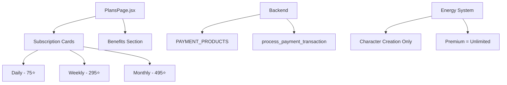

# Design Document: Unified Subscription System

## Overview

Переход от сложной системы с токенами и тремя уровнями подписок (Plus, Pro, Legendary) к единой подписке с тремя периодами (день, неделя, месяц). Все периоды дают одинаковые преимущества, отличаются только длительностью и ценой.

Ключевые изменения:
1. Удаление покупки токенов
2. Единая подписка вместо трёх уровней
3. Энергия тратится только на создание персонажей
4. Новый UI страницы подписок

## Architecture



## Components and Interfaces

### Frontend: PlansPage.jsx

Полностью переписанный компонент без табов и токенов:

```jsx
// Новая структура данных подписок
const subscriptionPlans = [
  { 
    id: 'subscription_daily', 
    period: 'day',
    stars: 75, 
    originalStars: null,  // Без скидки
    discount: null,
    popular: false 
  },
  { 
    id: 'subscription_weekly', 
    period: 'week',
    stars: 295, 
    originalStars: 500,
    discount: 41,
    popular: false 
  },
  { 
    id: 'subscription_monthly', 
    period: 'month',
    stars: 495, 
    originalStars: 2500,
    discount: 78,
    popular: true  // "Most Popular" badge
  }
];

// Единый список преимуществ (не дублируется)
const benefits = [
  { icon: '♾️⚡️', key: 'subscription.benefits.unlimitedEnergy' },
  { icon: '🔞', key: 'subscription.benefits.noBlur' },
  { icon: '🎭', key: 'subscription.benefits.enhancedAI' },
  { icon: '🧠', key: 'subscription.benefits.enhancedMemory' },
  { icon: '♻️', key: 'subscription.benefits.fasterGeneration' },
  { icon: '➕', key: 'subscription.benefits.characterBonus' },
  { icon: '💬', key: 'subscription.benefits.extendedDescription' }
];
```

### Backend: payment.py

Новые продукты подписок:

```python
PAYMENT_PRODUCTS = {
    # Unified subscription - 3 periods, same benefits
    "subscription_daily": {
        "type": "subscription",
        "period": "day",
        "duration": 1,
        "stars": 75,
        "original_stars": None  # No discount
    },
    "subscription_weekly": {
        "type": "subscription", 
        "period": "week",
        "duration": 7,
        "stars": 295,
        "original_stars": 500  # -41%
    },
    "subscription_monthly": {
        "type": "subscription",
        "period": "month", 
        "duration": 30,
        "stars": 495,
        "original_stars": 2500  # -78%
    }
}
```

### Energy System Changes

Энергия теперь тратится ТОЛЬКО на создание персонажей:

```python
# В character creation handler
def create_character(user_id, ...):
    user = get_user(user_id)
    
    # Premium users - free character creation
    if user.is_premium:
        # No energy deduction
        pass
    else:
        # Free users pay energy
        CHARACTER_CREATION_COST = 50  # или другое значение
        if user.energy < CHARACTER_CREATION_COST:
            raise InsufficientEnergyError()
        deduct_energy(user_id, CHARACTER_CREATION_COST)
    
    # Create character...
```

## Data Models

### Subscription Product Structure

```python
@dataclass
class SubscriptionProduct:
    id: str                    # "subscription_daily", "subscription_weekly", "subscription_monthly"
    type: str = "subscription" # Always "subscription"
    period: str                # "day", "week", "month"
    duration: int              # Days: 1, 7, 30
    stars: int                 # Current price in stars
    original_stars: Optional[int]  # Original price for discount display (None = no discount)
```

### User Premium Status

Упрощённая модель - все премиум пользователи равны:

```python
# Больше не используем premium_tier для различения уровней
# Все премиум пользователи получают одинаковые преимущества
user.is_premium: bool
user.premium_until: datetime
# premium_tier остаётся для обратной совместимости, но не влияет на функционал
```

## Correctness Properties

*A property is a characteristic or behavior that should hold true across all valid executions of a system—essentially, a formal statement about what the system should do. Properties serve as the bridge between human-readable specifications and machine-verifiable correctness guarantees.*

### Property 1: Subscription System Offers Exactly Three Periods
*For any* query to the subscription system, it SHALL return exactly three subscription options with periods: daily, weekly, and monthly.
**Validates: Requirements 1.1**

### Property 2: All Subscription Periods Provide Identical Benefits
*For any* subscription period (daily, weekly, monthly), the list of benefits SHALL be identical.
**Validates: Requirements 1.4**

### Property 3: Premium Users Have Equal Treatment
*For any* premium user, regardless of their previous tier (plus, pro, legendary) or current subscription period, they SHALL receive the same benefits and permissions.
**Validates: Requirements 6.4**

### Property 4: Localization Completeness
*For any* subscription-related UI key, translations SHALL exist in both English (en) and Russian (ru) locales.
**Validates: Requirements 5.1, 5.2, 5.3, 5.4**

### Property 5: Energy Consumption Only For Character Creation
*For any* user action other than character creation (messages, photos, etc.), the energy balance SHALL remain unchanged.
**Validates: Requirements 7.1, 7.2**

### Property 6: Premium Users Get Free Character Creation
*For any* premium user creating a character, their energy balance SHALL remain unchanged (unlimited energy).
**Validates: Requirements 7.3**

### Property 7: Free Users Pay Energy For Character Creation
*For any* free user creating a character, their energy balance SHALL decrease by the character creation cost.
**Validates: Requirements 7.4**

## Error Handling

### Payment Errors
- Invalid product ID → HTTP 400 "Invalid product ID"
- Insufficient stars → Telegram handles this
- Payment processing failure → Log error, notify admin, show user-friendly message

### Energy Errors
- Insufficient energy for character creation → Show "Not enough energy" with link to subscription page
- Premium check failure → Default to free user behavior (safe fallback)

## Testing Strategy

### Unit Tests
- Verify subscription product prices match specification
- Verify discount calculations (41%, 78%)
- Verify "Most Popular" badge on monthly plan
- Verify benefits list contains all required items

### Property-Based Tests
- Use Hypothesis (Python) for backend property tests
- Use fast-check (JavaScript) for frontend property tests
- Minimum 100 iterations per property test
- Tag format: **Feature: unified-subscription-system, Property N: description**

### Integration Tests
- End-to-end subscription purchase flow
- Premium status activation after payment
- Energy system behavior for premium vs free users
